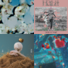
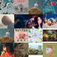
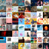
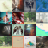
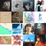
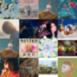
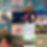
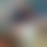

# Mosaics for Spotify
[](https://crates.io/crates/spotifymosaic)
[](./LICENSE.md)

A CLI tool for generating Spotify playlist covers using album artworks.

## Examples
> **NOTE:** The tool is capable of generating images up to size of 4096x4096, however the examples below are shown in an extremely low resolution, to place focus on the tool's features and not on artworks (which I do not own) themselves. The cover images all come from [this Spotify playlist](https://open.spotify.com/playlist/37i9dQZF1DXdbRLJPSmnyq).

### Default arguments
When only the required arguments are passed, the generated image will be identical to the default art set by Spotify for all new playlists:
<div align="center">



</div>

### Tile count
You can customize the count of mosaic tiles using the `--tiles <TILE_SIDE_LEN>` argument.

| `-t 2`  (default)              | `-t 4`                    | `-t 8`                    |
|:------------------------------:|:-------------------------:|:--------------------------:|
|  |  |  |

### Arrangement
You can order the tiles in predefined ways with `--arrange <ARRANGEMENT>`.

| `-a first`  (default)        | `-a last`                   | `-a random`                   |
|:----------------------------:|:---------------------------:|:-----------------------------:|
|  |  |  |

### Blur
The generated cover can be blurred with `--blur <PERCENTAGE>` to reduce visual clutter.

| `-b 5`                    | `-b 25`                    | `-b 100`                    |
|:-------------------------:|:--------------------------:|:---------------------------:|
|  |  |  |

## Installation
> **NOTE:** All of the current methods of installation require an installation of [Rust](https://www.rust-lang.org/tools/install). Precompiled binaries may be shipped in the future.

### From crates.io
```
cargo install spotifymosaic
```

### From GitHub
```
git clone https://github.com/tchojnacki/spotifymosaic.git
cargo install --path spotifymosaic
```

## Usage
### Basic
```
spotifymosaic <PLAYLIST_URI> [AUTHORIZATION]
```

Where:
- `<PLAYLIST_URI>` - URI of the playlist (in the form of `spotify:playlist:ID`)
- `[AUTHORIZATION]` - any form of authorization, described below

### Authorization
> **NOTE:** The tool requires authorization, so you should create an app following the [Spotify App Settings Guide](https://developer.spotify.com/documentation/general/guides/authorization/app-settings/).

#### Argument Client Credentials Flow
Currently, the only supported form of authorization is passing the `client_id` and `client_secret` from the [Spotify Client Credentials Flow](https://developer.spotify.com/documentation/general/guides/authorization/client-credentials/). Generate a pair of id and secret and pass them to the `--creds` CLI argument, separated by a colon (`:`).

### Help
```
USAGE:
    spotifymosaic [OPTIONS] <--creds <CLIENT_ID:CLIENT_SECRET>> <PLAYLIST_URI>

ARGS:
    <PLAYLIST_URI>    Spotify playlist URI

OPTIONS:
        --creds <CLIENT_ID:CLIENT_SECRET>
            Spotify client's ID and secret delimited by a colon

    -t, --tiles <TILE_SIDE_LEN>
            Number of tiles forming the mosaic's side [default: 2]

    -o, --out <OUTPUT_PATH>
            Output image file path [default: mosaic.png]

    -a, --arrange <ARRANGEMENT>
            Ordering of mosaic's squares [default: first] [possible values: first, last, random]

    -r, --res <RESOLUTION>
            Output image's resolution, may be rounded down [default: 640]

    -b, --blur <PERCENTAGE>
            Amount of blur applied to cover images [default: 0]

    -h, --help
            Print help information
```

## Disclaimers
- This project is not affiliated with nor endorsed by Spotify.
- The [Spotify Developers Design Guidelines](https://developer.spotify.com/documentation/general/design-and-branding/#using-our-content) state, that artwork provided by Spotify should not be cropped, overlaid or blurred in fan-made applications. Even though, obviously, images generated by the tool do not follow this rule, I believe that this tool does not violate the requirement, because the artworks are never actually displayed to any user inside the application. This app is merely an image editing utility, images generated by it are subject to the same regulations as manually edited images and users should abide to these regulations themselves.
